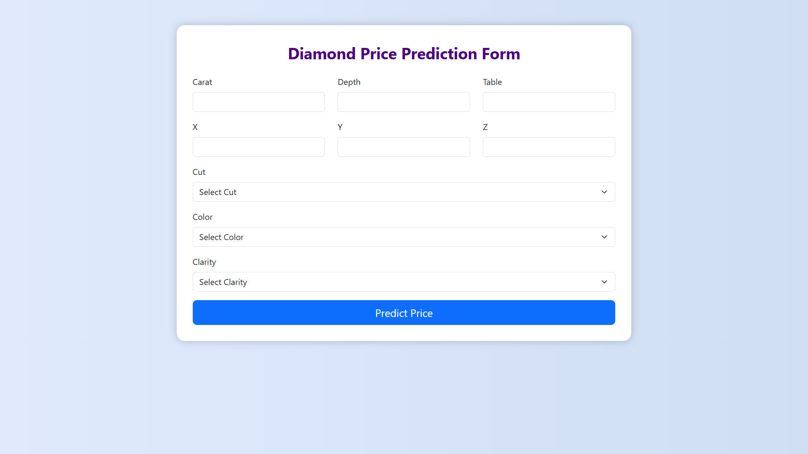

# 💎 Diamond Price Prediction

An end-to-end Machine Learning project that predicts the price of diamonds based on various attributes. The project includes all the necessary steps from **data ingestion** to **model training**, **evaluation**, and lays the foundation for deployment. This project is designed using a modular and scalable architecture that follows best practices for reproducibility and reusability.

---

## 📈 Project Overview

The price of a diamond depends on multiple factors like carat weight, cut quality, color, clarity, and physical measurements. Estimating diamond prices using machine learning can help buyers and sellers make informed decisions in the market.

This project uses **supervised learning regression algorithms** to predict diamond prices. The process includes:

- Fetching and preprocessing raw data
- Handling categorical and numerical features
- Imputing missing values
- Building transformation pipelines
- Training multiple regression models
- Selecting the best model based on performance metrics

---

## 📊 Dataset Details

The dataset used is from Kaggle: [Diamonds Dataset](https://www.kaggle.com/datasets/shivam2503/diamonds), containing over 50,000 entries of diamonds with the following features:

### Key Features:

| Feature     | Description                            |
|-------------|----------------------------------------|
| `carat`     | Weight of the diamond                  |
| `cut`       | Quality of the cut (Fair, Good, etc.)  |
| `color`     | Diamond color, from J (worst) to D (best) |
| `clarity`   | Diamond clarity (I1, SI2, ..., IF)      |
| `depth`     | Total depth percentage                 |
| `table`     | Width of the top of the diamond        |
| `x`, `y`, `z` | Physical dimensions in mm           |
| `price`     | Price in USD (target variable)         |

---

## 🎯 Business Objective

- Help online retailers or customers estimate the price of diamonds based on features.
- Enable transparency and automation in pricing mechanisms using ML.
- Provide fast predictions without manual appraisal.

---

## 🛠️ Tech Stack

- **Language**: Python 3.9+
- **Libraries**: 
  - Data: `pandas`, `numpy`
  - ML: `scikit-learn`, `joblib`
  - Visualization: `matplotlib`, `seaborn`
  - Logging & Exception: Custom `logger.py`, `exception.py`
- **Tools**: Git, Jupyter Notebook, VS Code
- **Version Control**: Git & GitHub

---

## 🔄 End-to-End Pipeline

The project is built in a modular pipeline structure:

1. **Data Ingestion**  
   - Loads the dataset  
   - Splits it into training and testing sets  
   - Saves them in the `artifacts/` directory  

2. **Data Transformation**  
   - Imputes missing values  
   - Encodes categorical features using `OrdinalEncoder`  
   - Scales numerical features with `StandardScaler`  
   - Builds a `ColumnTransformer` pipeline  

3. **Model Training**  
   - Trains various regression models:  
     - Linear Regression  
     - Lasso  
     - Ridge  
     - ElasticNet  
   - Evaluates using R² score  
   - Selects and saves the best model  

4. **Evaluation & Deployment (planned)**  
   - Model saved using `joblib`  
   - Flask API planned for real-time prediction

---

## 🖼️ Web Application Preview

### 🔹 Home Page

---

### 🔹 Prediction Form

---

installation:
  steps:
    - description: "Clone the repository"
      commands:
        - git clone https://github.com/siddhivdash/DiamondPricePrediction.git
        - cd DiamondPricePrediction

    - description: "Create a virtual environment"
      commands:
        - python -m venv venv
        - source venv/bin/activate  # Windows: venv\\Scripts\\activate

    - description: "Install dependencies"
      commands:
        - pip install -r requirements.txt

how_to_run:
  training_pipeline:
    description: "Run the training pipeline script"
    command: python src/pipeline/train_pipeline.py

  logs:
    description: "View logs or results (if logging is implemented)"
    note: "Logs will be created in the `logs/` directory"
